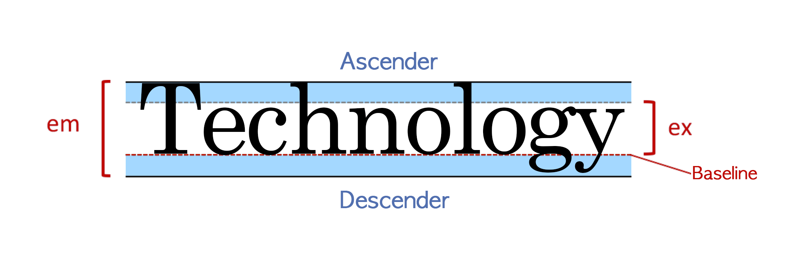

# 6.폰트, 텍스트
## 1) 속성-typography

### 타이포 그래피 구조

- baseline ★
- ascender ( b, d, h, l )
- descender ( g, j, p, q, y ) 
- x-height(= ex) 

5가지 외에도 세부적으로 다양한 용어가 있다.

https://cssreference.io/typography/

---

## 2) 속성-font-family

### font-family 속성
```CSS
font-family: family-name | generic-family ( | initial | inherit );
```
- family-name
    - 사용할 폰트 이름이다.
    - ','로 구분하며 먼저 선언된 순으로 우선순위가 결정된다.
    - 이름 중간에 공백이 있거나, 한글일 경우 홑따옴표로 묶어서 선언한다.
- generic-family
    - family-name으로 지정된 글꼴을 사용할 수 없을 경우, 브라우저가 대체할 수 있는 폰트를 지정한다.
    - font-family 속성의 맨 마지막에 선언한다.
    - 인용부호로 묶지 않는다(따옴표)

#### 사용 예
```css
font-family: Helvetica, Dotum, '돋움', Apple SD Gothic Neo, sans-serif; 
```

---
## 3) 속성-line-height
- line-height는 줄의 높이를 의미
- 이를 이용해 행간 간격을 조정할 수 있다.
```css
line-height: normal | number | length | initial | inherit ;
```
- normal
- number 
    - font-size 기준으로 배율로 적용
- length
    - px, em 등 고정 수치
- %
    - font-size만큼 퍼센트 배율로 적용
### 주의 할 점
 `number`를 선언할 때와 `%`로 선언할 때의 차이점 존재
 - `number` : 부모 요소의 숫자 값이 그대로 상속된다. 즉, 자식 요소에서도 또 한 번 자식 요소의 font-size를 기준으로 계산된 값을 가진다.
- `%` : 부모 요소에서 `%`값이 그대로 상속되는 것이 아니고, %에 의해 이미 계산된 `px`값이 상속된다

```css
body { font-size: 20px; line-height: 2; }       /* line-height = 40px; */
body { font-size: 20px; line-height: 200%; }    /* line-height = 40px; */
```
똑같이 40px 적용된다.<br><br>
```css
body { font-size: 20px; line-height: 2; }    /* line-height = 40px; */
p { font-size: 10px; }                                  /* line-height = 20px; */


body { font-size: 20px; line-height: 200%; }    /* line-height = 40px; */
p { font-size: 10px; }                                          /* line-height = 40px; */
```
상속이 달라진다. 가능하면 단위가 없는 값(숫자값)을 사용한다.

---
## 4) 속성-font-size
- absolute size 
    - 브라우저마다 기준이 달라 잘 사용하지 않는다.
- relative size
- viewport units
---
## 5) 속성-font-weight
- normal ★
- bold ★
- bolder
    - 부모 요소 보다 두껍게 표현
- lighter
    -부모 요소 보다 얇게 표현
- number
    - 100, 200, 300, 400, 500, 600, 700, 800, 900 (클수록 더 두껍게 표현)

폰트가 점차 다양해지면서 굵기 자체를 폰트 family-name으로 가지고 있는 경우도 있다.

---
## 6) 속성-font-style
- normal
- em
- italic
- oblique
    - 기울임 각도 설정 가능, 브라우저마다 달라 잘 사용 안한다.
---
## 7) 속성-font-variant
소문자를 작은 대문자로 변환

- normal
- small-caps
---
## 8) 속성-font
실무에선 지양하는 축약형이다. 
```css
font: font-style font-variant font-weight font-size/line-height font-family | initial | inherit;
```
### 유의 사항
- font-size와 font-family는 반드시 선언해야 하는 필수 속성입니다.
- 빠진 속성이 있다면 기본 값으로 지정됩니다.
- 각 속성의 선언 순서를 지켜야 합니다.
---
## 10) 속성-vertical-align
요소의 **수직 정렬**을 지정하는 속성
https://www.w3schools.com/cssref/pr_pos_vertical-align.asp

---
## 11) 속성-text-align
텍스트의 정렬을 지정하는 속성
- left
- right
- center
- justify

---
## 12) text-indent 속성
텍스트의 들여쓰기를 지정하는 속성입니다. 

- length: px, em 등 고정 수치로 지정. 음수 허용

- %: **부모 요소**의 width를 기준으로 퍼센트로 지정
---
## 13) 속성-text-decoration
텍스트의 장식을 지정하는 속성
https://www.w3schools.com/cssref/pr_text_text-decoration.asp

---
## 14) 속성-단어 관련 속성
### white-space
요소 안에 공백을 어떻게 처리할지 지정하는 속성
- normal : 공백과 개행을 무시하고, 필요한 경우에 자동 줄바꿈 발생. 기본 값
- nowrap : 공백과 개행을 무시하고, 자동 줄바꿈이 일어나지 않음.
- pre : 공백과 개행을 표현하고, 자동 줄바꿈이 일어나지 않음.
- pre-line : 공백은 무시하고, 개행만 표현. 필요한 경우에 자동 줄바꿈 발생.
- pre-wrap : 개행은 무시하고, 공백만 표현. 필요한 경우 자동 줄바꿈 발생.

### letter-spacing
- 자간을 지정하는 속성
### word-spacing
- 단어 사이의 간격을 지정하는 속성

### word-break ★
- 단어가 라인 끝에 나올 경우 어떻게 처리할지(중단점) 지정하는 속성
    - normal : 기본 값. 중단점은 공백이나 하이픈(-)(CJK는 음절)
    - break-all : 중단점은 음절. 모든 글자가 요소를 벗어나지 않고 개행
    - keep-all : 중단점은 공백이나 하이픈(-)(CJK는 그 외 기호도 포함)

### word-wrap 
- 요소를 벗어난 단어의 줄바꿈을 지정하는 속성
    - normal : 기본 값. 중단점에서 개행
    - break-word : 모든 글자가 요소를 벗어나지 않고 강제로 개행

word-break와 word-wrap은 언어의 종류(나라별 언어)에 따라 다르게 동작한다.  

---

## 생각해보기
### 3) 속성-line-height
- visual formatting model