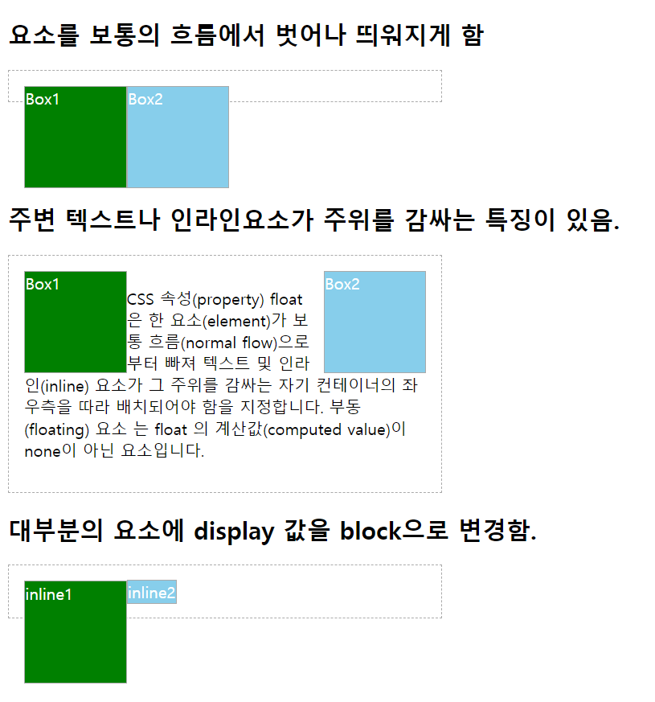

# 7. 레이아웃
## 1) display
- `inline` 요소는 margin, padding 좌우 값만 적용된다.
    - 실무에서도 좌우에만 적용한다.
    - 요소 옆에 공백이 있을 경우 4px의 여백이 생긴다.
    - 폰트, 텍스트와 연관이 많다.
- `block` ,`inline-block` 둘 다 블록 요소처럼 css 속성이 다 적용된다.
- `inline`과 `inline-blcok` 차이
    - inline은 한 행을 전부 차지한다.
    - inline-block 은 배치를 inline으로, 속성 적용은 block으로 적용된다.
    - inline 요소처럼 배치되기 때문에 요소 옆에 공백이 있을 경우 4px의 공간이 생긴다.

### display와 box model의 관계
| display | width | height | margin | padding | border |
|:------------:|:-----:|--------|--------|-------------------------|-------------------------|
| block | O | O | O | O | O |
| inline | X | X | 좌/우 | O(but 좌/우만 선언하기) | O(but 좌/우만 선언하기) |
| inline-block | O | O | O | O | O |
### 주의할점
- display 속성을 적용시켰다해서 태그의 본질과 맞지않게 코드를 작성하지 말것
- ex) `span > div` 의 span 태그에 display:block을 하는 등의 오류를 범하지 말자. 

https://www.w3schools.com/cssref/pr_class_display.asp

---
## 2) 속성-visibility
- visibility
    - `visible`
    - `hidden` : 공간은 그대로 차지한 상태에서 보이지 않음
    - `collapse` : 잘 사용 X, (IE, Firefox만 지원)

### display: none 과 차이점
- display:none은 아예 화면에서 렌더링 하지 않는다.
- 반면 visibility는 렌더링은 하지만 눈에 보이지 않을 뿐이다. 그래서 화면에 보여주진 않지만 제공해야할 때 사용한다.

---
## 3) 속성-float
- 보통의 흐름에서 벗어나 띄어지게 한다.
- 주변 텍스트나 인라인 요소가 감싸는 특징이 있다.
- 둥둥 떠다니지만 떠있는 그 영역은 계속 차지하고 있는 상태이다.
- 대부분의 요소의 display 속성을 block으로 처리한다.



### TIP
- 투명도 적용하며 확인하면 좋다.
---
## clear
- 요소를 floating 된 요소의 영향에서 벗어나게 하는 속성
    - none : 양쪽으로 floating 요소를 허용(기본값)
    - left : 왼쪽으로 floating 요소를 허용하지 않음
    - right : 오른쪽으로 floating 요소를 허용하지 않음
    - both : 양쪽으로 floating 요소를 허용하지 않음
- float과 clear는 한 세트다.
- block 요소에만 적용 된다.
    - inline-block 요소는 적용되지 않는다.(inline이다.)

### 실무 TIP
- float 적용된 속성마다 전부 clear를 부여하면 불필요한 속성이 너무 많이 선언된다.
- 그래서 실무에선 float이 적용된 요소의 부모에 자식요소를 하나 추가하고 그 자식요소에게 clear 속성을 부여한다.
```html
<h2>요소를 보통의 흐름에서 벗어나 띄워지게 함</h2>
<div class="container" style="width:400px;">
    <div style="float:left;">Box1</div>
    <div style="float:left;">Box2</div>
    <!--자식요소를 하나 추가한다.-->
    <span class ="" style="display:block; clear:both;" >
</div>

<h2 style="margin-top:100px;">주변 텍스트나 인라인요소가 주위를 감싸는 특징이 있음.</h2>
<div class="container" style="width:400px;">
    <div style="float:left;">Box1</div>
    <div style="float:right;">Box2</div>
    <p>블라블라블라....</p>
</div>
```
---
## Position
요소의 위치를 정하는 방법을 지정하는 속성
- static
    - default
    - offset 값이 들어가기는 하지만 실제로 적용되진 않는다.
- relative
    - 위치를 지정할 때 left - right, top - bottom 어디를 기준으로 둘 건지 고민해보고 지정하기 ex) left : -40 px == right : 40px 
- absolute
    - inline 요소이더라도 block으로 지정된다.
    - static 이외의 값이 적용된 부모 요소를 기준으로 위치 offset이 적용된다. static이 적용이 되있으면 그 상위 요소를 기준으로, 또 static이면 또..  최종적 body 요소가 기준이 된다.
    - 부모의 padding 영역을 영점(0, 0)으로 가진다.
- fixed
    - 부모의 position 값에 상관 없이 브라우저 기준으로 위치가 정해진다.
    - inline 요소이더라도 block으로 적용된다.

- sticky
    - 지원하는 브라우저가 적어 잘 사용하지 않는다.

---
## 6) 속성-z-index
박스가 겹치는 순서를 지정한다.
- position 값이 static이 아닌 경우 지정가능
- 순서 값이 없을 경우 생성순서(코드상 순서)에 따라 쌓임
- 부모가 z-index 값이 있을 경우 부모 안에서만 의미있음 ★
- 큰 값이 가장 위쪽(음수 사용 가능)

뭐가 제일 위일까?
```css
<div class="red" style="background: red;">RED</div>

<div class="blue" style="background: blue; margin-top: 30px; margin-left: 30px;">BLUE</div>

<div class="green" style="background: green; margin-top: 60px; margin-left: 60px;">GREEN</div>

<div class="orange" style="background: orange; margin-left: 90px;">ORANGE</div>                  

div { width: 100px; height: 100px; color: white; }
.red, .blue { position: absolute; }
.green { position: relative; }
.red { z-index:5; }
.blue { z-index:6; }
.green { z-index:7; }
.orange { z-index:8; } 
```

https://codepen.io/yongwon/pen/dXwyQq
https://www.w3schools.com/cssref/playit.asp?filename=playcss_z-index

---
## 7) HTML/CSS 유효성 검사

https://validator.w3.org/

