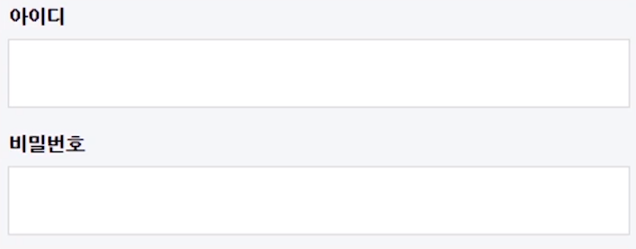
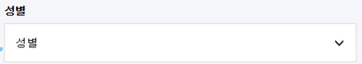
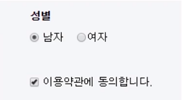
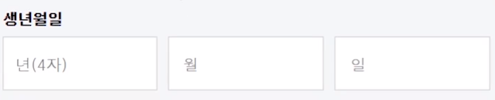
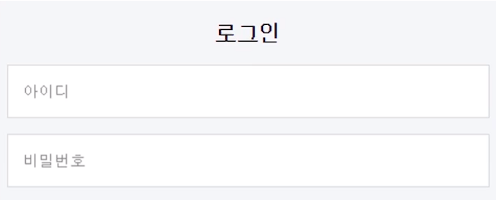

# 2. 웹 접근성의 이해

## 1. 웹 접근성의 이해
### 2) 장애 환경

#### 장애란?
- 어떤 사물의 진행을 가로막아 거치적거리게 하거나 충분한 기능을 하지 못하게 함. 또는 그런 일
- 이런 장애 환경에는 여러 장애들과 노안, 운전 중일 때 소음이 심할 때 스피커가 없어서 소리를 듣지 못할 때 소프트웨어가 지원되지 않거나 네트워크가 접속되지 않는 경우 등도 포함

#### 장애 환경
- 전맹 시각 장애
    - 단말기가 웹의 내용을 인식할 수 있게 만들어야한다.
- 저시력 시각 장애
    - 확대기능, 전색맹의 경우 고대비를 사용해 선명함 부여
- 중증 운동 장애
    - 보조 기기(헤드 포인터, 빅키 키보드, 키카드 등) 손 대신 사용할 수 있게 한다.
- 손 운동 장애
    - 정교한 조작이 불가능한 경우, 보조기기로도 정교한 조작이 가능하게 별도로 기능을 만들어 제공( 버튼 등)
- 청각 장애
    - 안내 문구나 자막 제공
- 맥 사용자
    - 윈도우에서만 사용이 가능한 경우
- 느린 인터넷
    - 인터넷이 느려 UI가 깨지는 경우


---
## 2. 웹 접근성 지침
### 0) 웹 접근성 지침 소개
- WCAG(Web Content Accessibility Guidelines) 
- KWCAG(Korean Web Content Accessibility Guidelines)

---

### 1) 적절한 대체 텍스트 제공 ★
시각적으로 제공하는 것과 듣는 것 동일하게 대체 텍스트를 제공해야한다.

#### alt로 대체 텍스트 제공

```html

```
- 스크린 리더로 들으면 alt 값을 읽어준다.
- `image` 태그 뿐만 아니라 다른 태그에 대체 텍스트가 필요한 경우에 `alt`속성을 적용한다.
<br><br>
#### 마크업으로 대체 텍스트 제공
대체 텍스트가 너무 긴 경우에는 이미지에는 대체 텍스트를 빈 값으로 제공하고 대체 텍스트를 마크업으로 제공하는 방법도 있다.
```html

<p class="blind">
    주식수수료 평생무료 비대면계좌개설 신규/온라인/유관기관 제비용 제외  
    2018년 12월 31일까지 선물/옵션 1년 무료, 신용이자 연 3.5% 60일 우대
</p>
```
- 예를 들어 이미지 내부 콘텐츠가 **리스트**로 되어 있어서 ul, li로 마크업하면 스크린리더에서 목록이라고 알아서 읽어주며 기본적으로 스크린리더는 해당 요소에 따라 내용을 읽어주기 때문에 **구조적 마크업이 가능한 콘텐츠**는 마크업으로 **대체 텍스트를 제공**해주는 것이 좋다.
- 주의할 점은 해당 마크업을 보이지 않게 `display:none`이나 `visibility:hidden`을 사용하여 **스크린리더에서 읽지 않도록** 보이지않게 처리해야한다.
<br><br>
#### 데이터 차트나 복잡한 콘텐츠
데이터 차트나 복잡한 콘텐츠도 사용자가 해당 콘텐츠의 의미를 충분히 파악할 수 있도록 대체 텍스트를 제공해야 한다. ex) 표, 차트
```html

<table class="blind">
    <caption>...</caption>
        <thead>
	 <tr>
	    <th scope="col">년도</th>
	    <th scope="col">학과</th>
	    <th scope="col">지원 수</th>
	</tr>
    </thead>
    <tbody>
       <tr>
           <td>2003</td>
           <td>언어학</td>
           <td>10200명</td>
       </tr>
     ...
    </tbody>
</table>
```
<br><br>
#### 의미 있는 이미지
의미 있는 이미지의 경우에도 대체 텍스트를 시각적으로 보는 것과 동등하게 제공해야 한다. ex) 다음 버튼 이미지, 홈버튼 이미지
```html
 
```
<br><br>
#### 배경 이미지
의미 있는 이미지가 이미지 요소가 아닌 배경으로 처리된 경우에도 다음와 같이 대체 텍스트를 제공해야한다.
```html
<a href="#" class="link_next">다음 콘텐츠 보기</a>
```
```css
 .link_next{
    background-image:url('./img/icon_next.png');
}
```
<br><br>
#### 의미 없는 이미지
- `alt` 속성을 부여하지 않으면 기본적으로 src 속성의 파일명을 읽어준다.
- 그래서 이미지는 **기본적으로 `alt` 태그를 필수로 입력**한다.
- `alt` 값에 띄어쓰기가 하나라도 적용되어 있는 경우도 마찬가지로 파일명을 읽는다.
- 단순 장식, 배경으로 사용되는 콘텐츠의 경우 아무것도 읽어주지 않도록 `alt`를 빈 값으로 제공해야 합니다.
```html

```
<br><br>
#### 이모티콘 이미지
시각적으로 인식하는 것과 동일하게 대체 텍스트를 제공해야 한다.
```html

```
<br><br>
#### QR코드 이미지
```html
<a href="http://www.naver.com">
    
</a> 
```
<br><br>
#### 썸내일 이미지
- 썸내일 사진과 텍스트가 함께 있는 콘텐츠의 경우
- 이미지와 텍스트를 **하나의 링크**로 묶어주고 대체 텍스트가 이미 존재하기 때문에 이미지에는 `alt`를 빈 값으로 제공해 주는 것이 좋습니다.
- 썸네일 이미지와 텍스트를 각각 링크로 구현하는 경우에도 하나로 묶어서 제공한다.

```html
<a href="…">
    
    <span>웨딩 사진을 모티브로 만든 도일리 #프랑스자수</span>
</a> 
```
<br><br>
#### 캡차 이미지
- 캡차 이미지에 대체 텍스트로 이미지에 있는 텍스트를 제공하면 스크린리더를 사용하는 분들에게는 **정답을 알려주는 것**
- 그래서 **대체 텍스트로 '캡차' 또는 '보안 문자'라고 제공**하고 **따로 음성으로 들을 수 있도록 청각적 캡차를 제공**해야한다.

<br><br>
#### 사용자가 업로드하는 이미지
- 사용자가 업로드하는 이미지의 경우 사용자가 **직접 대체 텍스트를 작성할 수 있도록** 안내와 함께 툴을 제공해야 한다.
- 사용자가 입력한 내용이 대체 텍스트로 제공되도록 구현한다.

---
### 2) 자막 제공
#### 멀티미디어 대체 수단 제공
- 자막, 대본, 원고, 수화 중 하나로 제공

#### 사용자가 업로드하는 멀티미디어
- 제3자가 영상을 업로드하는 경우 사용자가 대체 콘텐츠를 제공할 수 있도록 툴을 제공

#### 음성이 나오지 않는 영상
- 음성 정보 없이 텍스트만 제공되는 경우는 시각적으로만 인식이 가능하므로 따로 원고를 제공하는 등의 방법을 통해 대체 콘텐츠를 제공

---
### 3) 색에 무관한 콘텐츠 인식
색을 구분하기 힘든 사용자는 인식하기 어렵기 때문에 패턴, 굵기, 모양, 테두리 등의 다양한 방법으로 구분

#### 색으로만 구분한 사례
- 차트
- 슬라이드 버튼 선택 여부
- 페이지내이션
- 탭 버튼 선택 여부
---

### 4) 명확한 지시 사항 제공
- 지시 사항을 특정한 단일 감각에만 의존하는 방법으로 제공해서는 안 된다
- 즉, 여러 가지 다른 감각을 통해서도 지시 사항을 인식하는 데 문제가 없도록 콘텐츠를 제공해야한다.

---

### 5) 텍스트 콘텐츠의 명도 대비
- 텍스트와 배경색 간 명도 대비는 4.5 : 1 이상이 되도록 구현
- 다만, 로고, 장식 목적의 콘텐츠, 마우스나 키보드를 활용하여 초점을 받았을 때 명도 대비가 커지는 콘텐츠 등은 예외로 한다.
- 확대 가능한 브라우저에서는 , 3 : 1 정도면 준수한 명도 대비이다. 
- 이미지의 경우에도 명도대비를 준다
---
### 6) 자동 재생 금지
정지 상태로 제공되어야 하고 사용자가 요구할 경우에만 재생 가능하도록 제공해야 한다. 그렇지 않으면 스크린 리더기와 동영상 소리가 겹쳐 내용을 인식하기 어려워 진다.

#### 불가피하게 제공할 경우 해결 방안
- 3초 내에 정지
- ESC 키 선택 시 정지
- 소스 상 가장 먼저 제공하여 정지 기능 실행 가능하도록 구현
---
### 7) 콘텐츠 간의 구분
다양한 콘텐츠의 정보를 인식할 때 이웃한 콘텐츠와 구별될 수 있어야 한다.

#### 이웃한 콘텐츠 구분 방법
- 테두리 이용하여 구분
- 콘텐츠 사이에 시각적인 구분선을 삽입하여 구분
- 서로 다른 무늬를 이용하여 구분
- 콘텐츠 배경색 간의 명도대비(채도)를 달리하여 구분
- 줄 간격 및 글자 간격을 조절하여 구분
- 기타 콘텐츠를 시각적으로 구분할 수 있는 방법을 통해 구분
---
### 8) 키보드 사용 보장
웹 페이지에서 제공하는 모든 기능을 마우스가 없어도 키보드만으로도 사용할 수 있도록 제공해야한다. (붓, 그림 툴 같이 꼭 마우스가 필요한 경우는 예외)

#### 사례에 따른 해결 방안
- 마우스 오버 시 드롭 다운 메뉴가 노출
          >> 키보드 접근 시에도 드롭 다운 메뉴가 노출되고 메뉴에 접근 가능하도록 구현

- 자동 롤링 콘텐츠에 마우스 오버 시 전체 콘텐츠가 노출
          >> 키보드 접근 시에도 전체 콘텐츠가 노출되도록 구현

- 특정 버튼에 마우스 오버 시 레이어 노출
          >> 키보드 접근 시에도 레이어가 노출되도록 구현

- 이미지 또는 초점을 받을 수 없는 요소에 마우스 이벤트 적용
          >> 마우스로 조작 가능한 컨트롤의 경우 되도록 a링크나 버튼과 같이 초점을 받을 수 있는 요소로 구현

- a링크 요소에 href속성이 없는 경우
          >> 마우스로는 조작이 가능하지만 키보드 접근은 불가능. 따라서 a링크에는 href 속성을 반드시 제공

- a링크에 href속성은 있지만 onfocus="this.blur();"가 적용이 되어 있는 경우
          >> 초점을 초기화 시켜 이후 콘텐츠로 키보드 접근이 불가능하므로 onfocus="this.blur();" 제거하고 구현

- 키보드가 함정에 빠져 더 이상 키보드 접근이 되지 않는 경우
          >> 키보드가 함정에 빠지지 않고 마우스 사용시와 동일하게 접근 가능하도록 구현

---
### 9) 초점 이동
키보드에 의한 초점은 논리적으로 이동해야 하며, 시각적으로 구별할 수 있어야 한다.

#### 논리적 초점 이동
- 초점은 일반적으로 좌에서 우, 상에서 하로 이동할 것이라고 예측
-  초점 이동은 논리적 구조로 마크업하여 사용자가 예측하는 이동 순서와 일치해야 한다.
    ##### ex
    ```
    아이디 입력 → 비밀번호 입력 → **로그인 버튼** → 아이디 저장 ( x )

    아이디 입력 → 비밀번호 입력 → 아이디 저장 → **로그인 버튼**  ( o )
    ```

-  tabindex 속성을 이용하여 초점 이동을 강제로 변경하는 경우도 오류다.

- `hideFocus`적용하거나 CSS에서 `outline:none`처리를 하거나 `onfocus="this.blur();"`를 사용하면 전부 초점이 보이지 않게 되어 주의하여야 한다.

#### 레이어 팝업

초점 이동 순서 : 
```
레이어 팝업 노출시키는 컨트롤 > 레이어 팝업 내부 > 레이어 팝업 닫기 > 레이어 팝업 노출시키는 컨트롤
```
초점이 레이어 내부로 가지 않고 노출만 시킨 상태로 초점이 레이어 뒤로 가서 가려지는 경우 주의

초점이 보이지 않으면 키보드 사용자는 페이지를 잘 이용할 수 없으므로 논리적으로 초점을 이동시켜야 한다.

*초점이동 퀴즈확인하기

---
### 10) 조작 가능
- 조작 버튼은 대각선 6mm 이상 되어야 한다.
- 버튼 사이에 1px 이상의 여백이 존재해야 한다.
---
### 11) 응답 시간 조절
콘텐츠를 탐색하는데 시간이 오래 걸리는 사용자들은 시간제한이 있는 콘텐츠에서 충분히 콘텐츠를 이해할 시간이 필요하다.따라서 시간제한이 있는 콘텐츠는 응답 시간을 조절할 수 있어야 해야 한다. ex) 은행 로그인 세션 시간 연장 등

- 온라인 경매, 실시간 게임 등과 같이 반응 시간의 조절이 원천적으로 허용되지 않는 경우 예외
- 다만, 예외 경우에도 사용자에게 시간제한이 있다는 것을 미리 알려주고, 종료되었을 경우에도 알려주어야 한다.
- 세션 시간이 20시간 이상인 콘텐츠는 예외로 간주

#### 시간 연장이 불가능한 콘텐츠
- 충분한 시간 제공
- 종료 안내
- 조절 수단 제공
    -  시간제한이 반드시 필요할 경우에는 이를 회피할 수 있는 수단을 제공해야 한다.
    - 최소 20초 이상의 충분한 시간을 두고 사전에 알려 주어야 한다.

#### 페이지 자동 전환
페이지 진입 시 바로 리프래시되는 것이 아니라 Meta 요소의 refresh 속성 등을 사용하여 일정 시간이 지난 뒤 페이지가 자동 전환되는 경우도 마찬가지로 오류이다. 따라서 이전 예시처럼 연장할 수 있는 수단을 제공하거나 이를 해제할 수 있는 수단을 제공해야 한다.
- 연장 가능 수단 제공
- 해제 가능 수단 제공
---

### 12) 정지 기능 제공
자동으로 변경되는 콘텐츠는 움직임을 제어할 수 있어야한다.
#### ex
자동 변경 슬라이드
- 이전, 다음, 정지 기능을 제공해야 한다.
- 마우스 오버 시와 키보드 접근 시에 정지되도록 구현하면 정지 기능을 제공한 것으로 인정
---
### 13) 깜빡임과 번쩍임 사용 제한
초당 3~50회 주기로 깜빡이거나 번쩍이는 콘텐츠를 제공하지 않아야 한다.

#### 해결 방안
- 번쩍이는 콘텐츠가 차지하는 면적의 합이 화면 전체 면적의 10% 미만
- 시간을 3초 미만으로 제한
- 사전에 경고하고 중단 가능한 수단을 제공

깜빡임 검사 프로그램 : ['PEAT'](https://trace.umd.edu/peat)

---

### 14) 반복 영역 건너뛰기
웹 페이지의 공통적으로 들어있는 부분을 반복영역이라고 한다. 이미 들었던 부분을 다시 듣게 되기 때문에 건너뛸 수 있는 기능을 제공해야 한다.

####반복 영역 건너뛰기 제공 방법

- 마크업상 최 상단에 위치
- 건너뛰기 링크가 페이지 내에 존재
- 키보드 접근 시 화면에 노출
    - 8.키보드 접근
- "하단 메뉴로 바로 가기"와 같은 위치 정보 제공은 부적절
    - 하단이 어디인지 인식하기 힘들기 때문
    - 4.명확한 지시 사항 제공에 영향
        ```html
        <body>
            <div id="skip_nav">
                <a href="#content">본문 바로 가기</a>
                <a href="#menu">주 메뉴 바로 가기</a>
                …
            <div id="content">
                …
            <div id="menu">
                …
        </body>
        ```
---
### 15) 제목 제공

#### 페이지
- 페이지 제목은 유일하고 서로 다르게 제공해야 한다.
#### 프레임
- 프레임이나 아이프레임에도 각 프레임을 설명하는 간단 명료한 제목을 제공해야 한다.
    ```html
    <iframe src="https://nv.veta.naver.com/fxshow?su=SU10079&amp;nrefreshx=0"  title="광고"></iframe>
    ```
- 빈 프레임의 경우에도 title을 다음과 같이 "빈 프레임" 또는 "내용 없음" 등으로 제공해야 한다.
    ```html
    <iframe data-veta-preview="main_frame" title="빈 프레임" width="0" height="0" >
        <!DOCTYPE html>
        <html lang="ko">
        <head>
            <meta charset="utf-8">
            <title></title>
        </head>
        <body onload="initAd()" marginwidth="0" marginheight="0">
        </body>
        </html>
    </iframe>
    ```

#### 콘텐츠 블록
- 콘텐츠 블록에도 제목을 제공해야 한다.
    ```html
    <h3 class="an_tit">
        <a href="http://newsstand.naver.com" class="an_ta" target="_blank">뉴스스탠드</a>
    </h3>
    ```
- 제목을 숨김 처리할 경우 `display:none`나 `visibility:hidden`속성은 스크린리더에서 읽어주지 않기 때문에 다른 방법으로 보이지 않게 처리해야 한다.

#### 특수 기호 사용 제한
-  1개까지만 사용 제한
---
### 16) 적절한 링크 텍스트
링크의 용도나 목적지를 링크 텍스트만으로 또는 주변의 맥락으로부터 충분히 이해할 수 있도록 링크 텍스트를 제공해야 한다.

#### 빈 링크
- 없어야 한다.

<br>

#### 독립적 이미지 링크
```html
<a href="#">
    
</a> 
```
<br>

#### 독립적 배경 이미지 링크
```html
<a href="#" class="link_next">다음 콘텐츠 보기</a>
```
```css
 .link_next{
    background-image: url('./img/icon_next.png');
}
```
<br>

#### 썸내일 링크
```html
<a href="…">
    
    <span>웨딩 사진을 모티브로 만든 도일리 #프랑스자수</span>
</a> 
```
<br>

#### 명확한 링크 제공 ★
- '여기 링크'라고 읽어주게 되어 이 링크를 클릭하면 어떻게 되는지 알 수 없다.
- URL만 링크로 제공하는 것보다는 해당 주소의 목적을 함께 제공
```html
<p>
    더 자세한 사항을 보려면
    <a href="#">여기</a>를 클릭하세요.
</p>
```
- "더 보기"나 "자세히 보기" 같은 링크의 경우 어떤 콘텐츠의 더 보기인지 명확히 링크 텍스트를 제공해주는 것이 더 좋다.
- 예를 들어 "공지사항 더 보기"라고 공지사항 텍스트를 숨김 처리로 제공하는 등

---
### 17) 기본 언어 표시
- lang 속성으로 기본언어를 설정해준다. 
- "ISO639-1"에서 지정한 두 글자를 사용한다.

#### 중간에 다른 언어가 존재할 시
- 기본 언어 설정을 해둔 상태에서 중간에 다른 언어가 존재한다면 해당 영역에만 lang 속성으로 적절한 언어를 제공해주면 된다.
---
### 18) 사용자 요구에 따른 실행 ★
사용자가 의도하지 않았는데 새 창이 뜬다거나, 페이지가 새로 고침 된다거나 하는 등의 기능이 실행되지 않아야 한다.

#### 페이지 진입 시 뜨는 새 창(팝업)
- 사용자가 예측할 수 없는 상황에서 페이지 진입 시 새 창이 열리는 경우 오류이므로 새 창을 제공하지 않아야 한다.

#### 화면을 가리는 레이어 팝업
- 화면을 가리는 레이어 팝업을 제공한 경우도 오류.
- 이를 준수하기 위해서는 반복 영역 건너뛰기보다 먼저 팝업을 제어할 수 있도록 구현하거나 화면을 가리지 않고 가장 상단에 레이어 팝업을 제공해야 한다.

#### 사전에 인식할 수 없는 새 창
- 특정 링크 클릭 시 새 창이 뜨는 경우 스크린리더 사용자는 새 창이 뜬 것을 인지하기 힘드므로 이전 창인 줄 알고 계속 탐색할 수 있다.
- `blind`로 새 창이라는 텍스트를 넣어주거나 `title`로 새 창이라고 제공하거나 `target="blank"`로 적용하여 새 창이 열릴 것이라고 사전에 알려 주어야 한다.

##### 새창 제공 방법
```html
<a href="…">이용약관<span class="blind">새 창</span></a> ★제일 확실한 방법

또는

<a href="…" title="새 창">이용약관</a>

또는

<a href="…" target="_blank">이용약관</a>
```

#### 컨트롤 선택 시 기능 실행
- 콤보 상자, 라디오 버튼, 체크 상자 등의 컨트롤을 선택했을 때 자동으로 기능이 실행되거나 서식 제출이 일어나지 않아야 한다.
- 예를 들어, "오늘 하루 이 창을 열지 않음" 체크박스를 선택하자마자 팝업이 닫히는 경우 오류 → 닫기 버튼을 제공해야 한다.

#### select에 onchange 이벤트 적용
- 포커스를 옮기는 동작만으로, 초점을 받은 것만으로, 새 창이나 레이어가 뜨거나 페이지가 바뀌는 경우 모두 사용자가 원하지 않은 기능이 실행되는 것이므로 오류이다. ex) onFocus, onKeypress
- `select`에 `onchange 이벤트`가 적용되어 option을 선택하자마자 페이지가 이동된 경우 오류
---
### 19) 콘텐츠의 선형 구조 ★
콘텐츠는 논리적인 순서로 제공해야 한다.

#### 탭 제목-내용 콘텐츠
-  **메뉴 → 내용 → 메뉴 → 내용 순**으로 마크업하거나 **메뉴끼리 내용끼리 마크업하되** 내용에 해당 메뉴 **제목을 제공해 주어야** 한다.
##### 1) 탭 1제목 > 탭 1내용 > 탭 2제목 > 탭 2내용
```html
<a href="…">상품</a>
<div>상품 내용</div>
<a href="…">쇼핑몰</a>
<div>쇼핑몰 내용</div>
…
```
##### 2) 해당 탭 콘텐츠에 제목 제공
```html
<ul>
    <li><a href="…">상품</a></li>
    …
</ul>
<div>
    <h2 class="blind">상품</h2>
     상품 내용
</div>
```

#### 제목-내용-더 보기 콘텐츠
순서는 **제목 →  내용 →  더 보기** 버튼 순으로 마크업 해주어야 한다. 그 후 디자인을 바꾼다.
```html
<div class="noti_section">
    <!-- 제목 -->
    <h3><span class="blind">공지사항</span></h3>
        <!-- 내용 -->
        <ul class="lst_noti">
            <li>
                <a href="…">[복구완료] 10/19 (금), '뮤직'...</a>
            </li>
            <li>
                <a href="…">[복구완료] 10/17 (수), '지도'...</a>
            </li>
        </ul>
        <!-- 더 보기 -->
        <a href="…"><span class="blind">공지사항</span>더보기</a>
</div>
```
---
### 20) 표의 구성
스크린리더가 마크업에 따라 표를 읽어주기 때문에 데이터를 표로 구성할 경우 표의 내용, 구조 등을 이해할 수 있게 제목 셀과 데이터 셀이 구분되도록 구성해야 한다.

#### 표의 구성
- 제목 셀과 내용 셀 구분
- 제목과 요약 정보 제공
- 제목 셀은 th로, 내용 셀은 td로 마크업한다.

또한 제목 셀이 가로, 세로로 있는 경우 `scope`로 행 제목인지 열 제목인지 구분 가능하도록 제공해야 한다.

##### XHTML, HTML4
caption으로 제목을 제공, table의 summary 속성으로 요약 정보를 제공
```html
<table summary="부서별 직원 수, 합계 정보">
	<caption>직원 관리 현황 표</caption>
	<thead>
		<tr>
			<th scope="col">번호</th>
			<th scope="col">부서</th>
			<th scope="col">직원 수</th>
		</tr>
	</thead>
	<tfoot>
		<tr>
			<th scope="row">합계</th>
			<td></td>
			<td>15명</td>
		</tr>
	</tfoot>
	<tbody>
		<tr>
			<td>1</td>
			<td>총무부</td>
			<td>5명</td>
		</tr>
		<tr>
			<td>2</td>
			<td>인사부</td>
			<td>4명</td>
		</tr>
		<tr>
			<td>3</td>
			<td>기획부</td>
			<td>6명</td>
		</tr>
	</tbody>
</table>
```

##### HTML5
HTML5부터는 summary 속성이 없어졌으므로 caption에 제목과 요약 정보를 모두 제공

* caption 내부에 있는 태그는 시각적으로 제목과 요약 정보를 구분하기 위한 태그로 필수는 아닙니다.
```html
<table>
	<caption>
		<strong>직원 관리 현황 표</strong>
		<span>부서별 직원 수, 합계 정보</span>
	</caption>
	<thead>
		<tr>
			<th scope="col">번호</th>
			<th scope="col">부서</th>
			<th scope"col">직원 수</th>
		</tr>
	</thead>
	<tbody>
		<tr>
			<td>1</td>
			<td>총무부</td>
			<td>5명</td>
		</tr>
             …
</table> 
```
<br>

#### 복잡한 표 ★
`id`와 `headers` 속성을 이용하여 제목 셀과 내용 셀을 보다 정확하게 연결한다.
```html
<thead>
    <tr>
        <th rowspan="2" scope="col" id="date">기준일</th>
        <th colspan="2" scope="col" id="gsale">경기도 매매가</th>
    </tr>
    <tr>
        <th scope="col" id="price">면적단가</th>
        <th scope="col" id="change">변동액</th>
    </tr>
</thead>
<tbody>
    <tr>
        <th scope="row" id="d20181020">2018.10.20</th>
        <td headers="date d20181020 gsale price">902</td>
        <td headers="date d20181020 gsale change">유지 0</td>
    </tr>
    <tr>
        <th scope="row" id="d20181021">2018.10.21</th>
        <td headers="date d20181021 gsale price">904</td>
        <td headers="date d20181021 gsale change">상승 2</td>
    </tr>
</tbody>
```
제목 셀마다 각각 다른 `id` 값을 부여하고, 내용 셀과 관련이 있는 제목 셀의 `id` 값을 `headers`에 나열해준다.

스크린리더에서는 `headers`에 나열된 `id` 값 순서대로 제목 셀을 읽어준다.

즉, 이 "902"를 그냥 "902"라고 읽어주는 것이 아니라, "기준일 2018년 10월 20일 경기도 매매가 면적단가 902"라고 제목들을 연결해 읽어준다. 
<br>

#### 레이아웃 테이블
데이터 테이블이 아닌 레이아웃 테이블은 테이블로 마크업하지 않고 구조적으로 마크업하는 것이 좋다.

만약 테이블로 마크업할 경우 데이터 테이블로 착각하여 혼란을 줄 수 있기 때문에 caption, summary, th를 제공하지 않아야 한다.

---
### 21) 레이블 제공 ★
레이블이란 모든 사용자 입력의 용도 또는 역할에 대한 설명을 뜻한다.
#### 레이블이 시각적으로 노출되어 있는 경우

##### 1) 레이블과 입력 서식이 1:1 매칭인 경우
레이블을 제공하고 label `for` 값과 input의 `id` 값을 동일하게 제공


```html
<label for="user_id">아이디</label>
<input type="text" id="user_id" />

<label for="user_pw">비밀번호</label>
<input type="text" id="user_pw" />
```

##### 2) 레이블과 선택 서식이 1:1 매칭인 경우

```html
<label for="user_gender">성별</label>
<select id="user_gender">
    <option value selected>성별</option> 
    <option value="0">남자</option> 
    <option value="1">여자</option> 
</select>
```

##### 3) 레이블과 라디오 버튼, 체크 박스가 1:1 매칭인 경우

```html
<input type="radio" id="gender_male" />
<label for="gender_male">남자</label>
<input type="radio" id="gender_female" />
<label for="gender_female">여자</label>

<input type="checkbox" id="agree" />
<label for="agree">이용약관에 동의합니다.</label>
```

##### 4) 레이블과 입력 서식이 1:다 매칭인 경우
각 입력 서식에 대해 `title`을 제공


```html
<input type="text" title="생년월일 중 년 4자리 입력" />
<input type="text" title="생년월일 중 월 입력" />
<input type="text" title="생년월일 중 일 입력" />
```

#### 레이블이 시각적으로 노출되지 않은 경우
각 입력 서식에 대해 `title`을 제공


```html
<input type="text" title="아이디" />
<input type="text" title="비밀번호" />
```
---
### 22) 오류 정정
입력 서식 작성 시, 사용자의 실수로 오류가 발생할 경우 이를 정정할 수 있는 방법을 제공해야 한다.
- 입력 서식 작성 시 오류가 발생하여 입력 내용이 모두 사라지는 경우 오류이다. 부분만 수정할 수 있도록 제공해야 한다.

- 오류가 발생하는 경우 사용자에게 오류가 발생한 원인을 알려 주어야
- 오류가 발생한 입력 서식으로 초점이 이동해야 한다.

---
### 24) 웹 애플리케이션 접근성 준수
웹 애플리케이션에 대한 접근성 프로그래밍 인터페이스 사용을 지원한다거나 대체 수단을 제공하거나 보조 기술을 지원해야 한다.

예를 들어, 접근성이 어려운 플래시의 경우 HTML 버전을 선택할 수 있는 대체 수단이나 대체 텍스트를 제공해야한다.

---

## 3. 웹 접근성 진단 도구
### 1) 웹 접근성 진단 도구
#### Colour Contrast Analyser (CCA)

- 전경 색과 배경색의 명도 대비를 체크해주는 프로그램
- 현재까지 최신 버전 2.5.0
- 명도 대비는 최소 3:1 이상이 되도록 구현


#### KWCAG a11y inspector

- 컨트롤의 대각선 길이를 측정해주는 프로그램
- 크롬 웹 스토어에서 설치 가능
- 웹에서의 컨트롤 크기는 대각선 6mm 이상으로 구현
 

#### OpenWAX

- 접근성을 자동으로 진단해주는 프로그램
- 크롬 웹 스토어에서 설치 가능
- 자동 진단이 정확하지는 않아 수동 진단 병행 필요
 

#### W3C Validation

- 웹 표준을 검사하는 사이트
- 접근성 오류, 특히 마크업 오류 확인 시 많이 사용

---