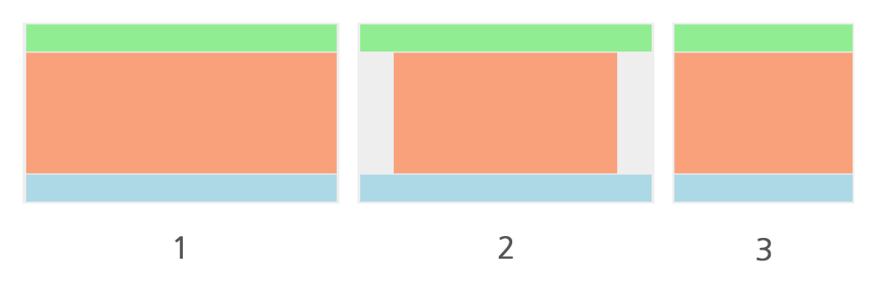

# 3. HTML&CSS 활용

## 1. 레이아웃
### 2) 1단 레이아웃 제작

- header 영역, content 영역, footer 영역 세로로 세 영역을 배치한 레이아웃

### 실습
#### 조건
- 컨텐츠 최대 가로 길이: 1200
- 사이트 최소 가로 길이: 800
- 컨텐츠 가운데 정렬

#### 내용
##### wrap
- 일반적으로 레이아웃을 만들때 wrap이나 wrapper라는 이름으로 부모요소를 만들어준다.
- 상황에 따라 필요 없을 수 있다.
- 일종의 도화지를 만든 것
- 이 안에 요소들을 배치한다.

##### content 영역
- 내용물에 따라 높이가 바뀌기 때문에 보통 height을 설정하지 않는다.
- 하지만 학습을 위해 이번 실습에선 height을 설정한다.
- 중복 선언 주의

##### 컨텐츠 최대 가로 길이: 1200
- `max-width` 사용

##### 사이트 최소 가로 길이: 800
- `min-width` 사용

##### 컨텐츠 가운데 정렬
- `margin: 0 auto`

#### 완성 모습

#### 추가사항
- 에릭 마이어의 [reset CSS](https://meyerweb.com/eric/tools/css/reset/)
