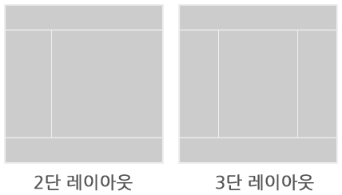
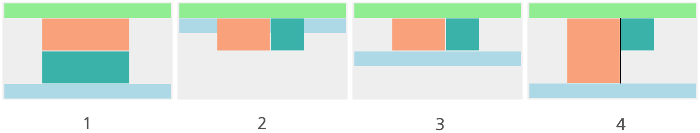

# 3. HTML&CSS 활용

## 1. 레이아웃
### 2) 1단 레이아웃 제작

- header 영역, content 영역, footer 영역 세로로 세 영역을 배치한 레이아웃

### 실습
#### 조건
- 컨텐츠 최대 가로 길이: 1200
- 사이트 최소 가로 길이: 800
- 컨텐츠 가운데 정렬

#### 내용
##### wrap
- 일반적으로 레이아웃을 만들때 wrap이나 wrapper라는 이름으로 부모요소를 만들어준다.
- 상황에 따라 필요 없을 수 있다.
- 일종의 도화지를 만든 것
- 이 안에 요소들을 배치한다.

##### content 영역
- 내용물에 따라 높이가 바뀌기 때문에 보통 height을 설정하지 않는다.
- 하지만 학습을 위해 이번 실습에선 height을 설정한다.
- 중복 선언 주의

##### 컨텐츠 최대 가로 길이: 1200
- `max-width` 사용

##### 사이트 최소 가로 길이: 800
- `min-width` 사용

##### 컨텐츠 가운데 정렬
- `margin: 0 auto`

#### 완성 모습


#### 추가사항
- 에릭 마이어의 [reset CSS](https://meyerweb.com/eric/tools/css/reset/)
---
### 3) 다단 레이아웃 제작



#### 실습
##### 주요 기능 

- 콘텐츠의 행(column)이 두개를 갖는다.
- 콘텐츠와 사이드영역의 구분선을 갖는다.
- 구분선은 헤더와 푸터에 항상 맞닿는다. 

##### 스타일 정보
- 콘텐츠 영역 가로길이: 500px
- 사이드 영역 가로길이: 300px
##### 주요 태그 및 속성 
- HTML
    - div
- CSS
    - float
    - clear
    - display: table
    - display: table-cell
    - content

##### 내용 (float 사용)
###### 요소 정렬하기
- 가상 요소를 선언해 clear : `::after`
- container 영역의 높이값 100% 설정
    - 부모값을 상속받는 다는 것을 주의하자.
    - 최상위 요소(`<html>`, `<body>`, `.wrap`)에 높이를 지정해주어야한다.
- `header` 영역이 fixed가 아니기 때문에-> 무슨말?

###### 구분선 넣기
- `container` 영역 안에 두 콘텐츠의 구분선을 넣을 때 border의 굵기를 고려해야한다.
    - `content` 의 가로를 500px로 유지하고 싶다면
    - `content` 가로 : 500px, `border` 굵기 : 5px -> 505px이 되므로 width 값을 495px로 하거나, `box-sizing : border-box`를 사용한다.
- 구분선은 `.content` 영역의 높이에 따라 결정된다. 그래서 border 속성이 아닌 가상요소를 만들어 콘텐츠의 높이에 영향받지 않는 구분선을 만들어야 한다.




##### 내용 ( display: table, table-cell 사용 )
- float 보다는 상대적으로 편한 방식

###### 요소 정렬하기
```css
.header {
    height:100px;
    background-color: lightgreen;
}
.container {
    display: table; /* 부모 요소에 display: table 추가 */
    width: 800px;
    margin: 0 auto;
}
.content {
    display: table-cell; /* 자식 요소에 display: table-cell 추가 */
    width: 500px; /* 가로 사이즈 부여 ( aside가로길이 =  container 가로길이 - content 가로길이) */
    height: 300px;
    background-color: lightsalmon;
}
.aside {
    display: table-cell;/* 자식 요소에 display: table-cell 추가 */
    height: 300px;
    background-color: lightseagreen;
}
.footer {
    height:100px;
    background-color: cornflowerblue;
}
``` 
###### 구분선 추가하기
```css
.header {
    height:100px;
    background-color: lightgreen;
}
.container {
    display: table; 
    width: 800px;
    margin: 0 auto;
}
.content {
    display: table-cell; 
    width: 495px; /* -5px 하여 추가된 구분선 만큼 빼기 */ 
    height: 300px;
    background-color: lightsalmon;
    border-right: 5px solid #000; /* border를 이용해 구분선 추가 */
}
.aside {
    display: table-cell;
    height: 300px;
    background-color: lightseagreen;
}
.footer {
    height:100px;
    background-color: cornflowerblue;
}
```

본문 : https://www.edwith.org/boostcourse-ui/lecture/34579/

---