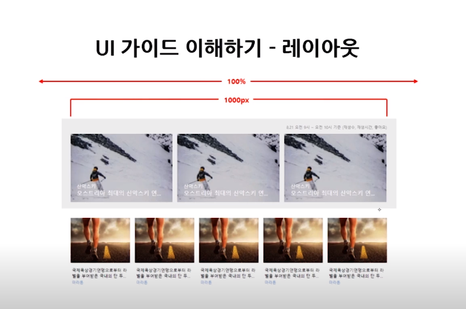

# 3. HTML&CSS 활용

## 1. 레이아웃
### 2) 1단 레이아웃 제작

- header 영역, content 영역, footer 영역 세로로 세 영역을 배치한 레이아웃

### 실습
#### 조건
- 컨텐츠 최대 가로 길이: 1200
- 사이트 최소 가로 길이: 800
- 컨텐츠 가운데 정렬

#### 내용
##### wrap
- 일반적으로 레이아웃을 만들때 wrap이나 wrapper라는 이름으로 부모요소를 만들어준다.
- 상황에 따라 필요 없을 수 있다.
- 일종의 도화지를 만든 것
- 이 안에 요소들을 배치한다.

##### content 영역
- 내용물에 따라 높이가 바뀌기 때문에 보통 height을 설정하지 않는다.
- 하지만 학습을 위해 이번 실습에선 height을 설정한다.
- 중복 선언 주의

##### 컨텐츠 최대 가로 길이: 1200
- `max-width` 사용

##### 사이트 최소 가로 길이: 800
- `min-width` 사용

##### 컨텐츠 가운데 정렬
- `margin: 0 auto`

#### 완성 모습


#### 추가사항
- 에릭 마이어의 [reset CSS](https://meyerweb.com/eric/tools/css/reset/)
---
### 3) 다단 레이아웃 제작


#### 실습
##### 주요 기능 

- 콘텐츠의 행(column)이 두개를 갖는다.
- 콘텐츠와 사이드영역의 구분선을 갖는다.
- 구분선은 헤더와 푸터에 항상 맞닿는다. 

##### 스타일 정보
- 콘텐츠 영역 가로길이: 500px
- 사이드 영역 가로길이: 300px
##### 주요 태그 및 속성 
- HTML
    - div
- CSS
    - float
    - clear
    - display: table
    - display: table-cell
    - content

##### 내용 (float 사용)
###### 요소 정렬하기
- 가상 요소를 선언해 clear : `::after`
- container 영역의 높이값 100% 설정
    - 부모값을 상속받는 다는 것을 주의하자.
    - 최상위 요소(`<html>`, `<body>`, `.wrap`)에 높이를 지정해주어야한다.
- ★`header` 영역이 fixed가 아니기 때문에 header 영역의 ㄴ

###### 구분선 넣기
- `container` 영역 안에 두 콘텐츠의 구분선을 넣을 때 border의 굵기를 고려해야한다.
    - `content` 의 가로를 500px로 유지하고 싶다면
    - `content` 가로 : 500px, `border` 굵기 : 5px -> 505px이 되므로 width 값을 495px로 하거나, `box-sizing : border-box`를 사용한다.
- 구분선은 `.content` 영역의 높이에 따라 결정된다. 그래서 border 속성이 아닌 가상요소를 만들어 콘텐츠의 높이에 영향받지 않는 구분선을 만들어야 한다.


##### 내용 ( display: table, table-cell 사용 )
- float 보다는 상대적으로 편한 방식

###### 요소 정렬하기
```css
.header {
    height:100px;
    background-color: lightgreen;
}
.container {
    display: table; /* 부모 요소에 display: table 추가 */
    width: 800px;
    margin: 0 auto;
}
.content {
    display: table-cell; /* 자식 요소에 display: table-cell 추가 */
    width: 500px; /* 가로 사이즈 부여 ( aside가로길이 =  container 가로길이 - content 가로길이) */
    height: 300px;
    background-color: lightsalmon;
}
.aside {
    display: table-cell;/* 자식 요소에 display: table-cell 추가 */
    height: 300px;
    background-color: lightseagreen;
}
.footer {
    height:100px;
    background-color: cornflowerblue;
}
``` 
###### 구분선 추가하기
```css
.header {
    height:100px;
    background-color: lightgreen;
}
.container {
    display: table; 
    width: 800px;
    margin: 0 auto;
}
.content {
    display: table-cell; 
    width: 495px; /* -5px 하여 추가된 구분선 만큼 빼기 */ 
    height: 300px;
    background-color: lightsalmon;
    border-right: 5px solid #000; /* border를 이용해 구분선 추가 */
}
.aside {
    display: table-cell;
    height: 300px;
    background-color: lightseagreen;
}
.footer {
    height:100px;
    background-color: cornflowerblue;
}
```

본문 : https://www.edwith.org/boostcourse-ui/lecture/34579/

---
## 2. 메뉴
### 2) 1단 메뉴 제작
#### 제작 화면


#### 주요 기능 
- 5개의 항목을 갖는 가로 메뉴 
- 메뉴의 간격은 모두 동일
- 선택 메뉴는 볼드 처리
- 메뉴 활성화 시 배경색과 폰트 컬러 변경 

#### 스타일 정보
- 메뉴 - 전체 너비(min/max): 500px/700px
- 메뉴 - 높이: 36px
- 메뉴 - 폰트: 12px/#333, 외곽선: 1px/#ddd
- 메뉴(활성화 시) - 배경색: gray, 폰트: 12px/bold/#fff, - - 외곽선: 1px/#555

#### 주요 태그 및 속성 
- HTML
    - div, ul, li, a
- CSS
    - display, position, border, margin, background
    - table-layout, :hover

#### 추가사항
- display: table
- table-layout:fixed
- `<a>` 태그 display:block;
- line-height;
- 붙어있는 메뉴 border 주의 (2px로 나옴)   
    - margin-left: -1;
- ★ `hover`를 줄때 메뉴 상위 요소(.menu_item)에게 부여한다.
- ★ `position:relative`를 선언하지 않으면 뒤의 요소 z-index가 위로 올라간다. `position:relative`를 선언하면 z-index가 새로 생성되어 .active요소가 올라간다.
---

### 2) 2단 메뉴 제작
#### 제작 화면


#### 주요 기능 
- 메인, 서브 메뉴를 갖는 2단 가로 메뉴 
- 메인, 서브 메뉴는 가로 중앙 정렬 처리
- 메인 선택 메뉴는 볼드, 컬러 변경 처리
- 서브 선택 메뉴는 볼드, 컬러 변경, 하단 라인 추가 처리

#### 스타일 정보
- 메인/서브 메뉴 - 높이: 50px
- 메인 메뉴 - 폰트: 20px/#333
- 메인 메뉴 (오버/활성화 시) - 폰트: 20px/bold/green
- 서브 메뉴 - 폰트: 17px/#333
- 서브 메뉴 (오버/활성화 시) - 폰트: 17px/bold/green, 하단 라인: 2px/green

#### 주요 태그 및 속성 
- HTML
    - div, ul, li, a, span
- CSS
    - position, border, margin, padding, background text-align, :after, :hover
 
 #### 추가사항
 - `.menu_link`는 `.menu_item`과 동일한 크기를 가져야 하므로 `display:block`
 - 서브 메뉴는 해당 아이템(`.menu_item`) 안에다가 만든다.
 - ★서브 메뉴에 `position:absolute`를 사용하지만 그 부모요소(`.menu_item`)에 `postiion:relative`를 부여하면 안된다.
 - ★서브메뉴 활성화시 생기는 밑줄을 텍스트 너비에 맞게 만들기 위해서 width값을 설정하는 것 보다 `<span>`태그와 `가상 선택자`를 사용해 항상 텍스트 너비에 맞게 만들어지게 해준다.  
 ---
## 3. 이미지 목록
### 2) 이미지 목록 제작

#### UI 가이드 이해하기
##### 레이아웃

- 브라우저가 특정 너비보다 커지더라도 콘텐츠는 좌우 여백이 동일한 크기로 중앙정렬되어야 한다. 


##### 메인 이미지 리스트


##### 서브 이미지 리스트


#### 주요 기능 

- 메인, 서브 리스트로 구성된 2단 이미지 리스트 
- 메인, 서브 리스트는 가로 중앙 정렬 처리
- 메인 리스트는 이미지 위 레이어 형태의 말줄임 텍스트 노출
- 서브 리스트는 이미지 하단에 말줄임 텍스트 노출

#### 스타일 정보
- 메인/서브 리스트 - 전체 가로 너비: 1000px
- 메인 리스트 -  메인 이미지: 322x215, 배경색: #ececec, 외곽선: 1px/solid/#000(투명도 5%)
- 메인 리스트 - 카테고리 폰트: 14px/#fff, 제목 폰트: 18px/#fff 
- 서브 리스트 -  서브 이미지: 188x141, 외곽선: 1px/solid/#000(투명도 3%)
- 서브 리스트 - 카테고리 폰트: 12px/#7ba7df, 제목 폰트: 15px/#090909

#### 주요 태그 및 속성 
- HTML
    - div, img, a, ol
- CSS 
    - float, position, ellipsis, :after, :nth-child

#### 1. 이미지 리스트 정렬 
[codepen 확인하기](https://codepen.io/hoonJJang/pen/KxwRPb)
- `.main_list`의 여백을 줄 땐 형제선택자를 사용한다.
- `.sub_list`의 각 라인 마지막 요소의 우측여백을 주지 않기 위해 `nth-child()`를 사용해 0으로 초기화한다.

#### 2. 텍스트 말줄임
[codepen 바로가기](https://codepen.io/hoonJJang/pen/OoPZLQ)
```html
<p class="elip1">가나다라마바사아자차카타파하가나다라마바사아자차카타파하가나다라마바사아자차카타파하</p>
<p class="elip2">가나다라마바사아자차카타파하가나다라마바사아자차카타파하가나다라마바사아자차카타파하</p>
<p class="elip3">가나다라마바사아자차카타파하가나다라마바사아자차카타파하가나다라마바사아자차카타파하</p>
```
```css
p {
  width: 200px;
  background-color: yellow;
  font-size: 16px;
  line-height: 20px;
}
.elip1 {
  overflow: hidden; /* 넘어가면 안보이게 하기위해*/
  text-overflow: ellipsis; /* 보이지 않는 부분은 ... 처리*/
  white-space: nowrap; /* 한줄 말줄임의 경우 줄바꿈이 되면 안되기 때문에 설정*/
}
.elip2 {
  max-height: 40px; /* webkit 외 브라우저 대응, line-height*line수 */
  overflow: hidden;
  text-overflow: ellipsis;
  display: -webkit-box;
  -webkit-box-orient: vertical;
  -webkit-line-clamp: 2;
}
.elip3 {
  max-height: 60px; 
  overflow: hidden;
  text-overflow: ellipsis;
  display: -webkit-box;
  -webkit-box-orient: vertical;
  -webkit-line-clamp: 3;
}
```
- 말줄임을 하기 위해 **고정너비**가 설정되어있어야 한다. (`<p>`)
- IE, FireFox 계열에선 height 값을 꼭 선언해주어야한다.
    - `line-clmap` : 줄 의미
- `max-height`로 높이를 설정해주어야 콘텐츠 양에 따라 높이가 가변처리된다.

#### 3. 이미지 액자 효과
[codepen 바로가기](https://codepen.io/hoonJJang/pen/MqYqpN)
```html
<div class="img_wrap">
  
<div>
```
```css
.img_wrap {
  position: relative;/* 가상선택자를 위해 선언 */
  width: 200px;
  height: 134px;
}
.img_wrap:after {
  position: absolute; /* 이미지 위로 띄우기 위해 사용 */
  top: 0;
  right: 0;
  bottom: 0;
  left: 0;
  /*너비, 높이는 부모에게 상속받는다.*/
  content: '';
  border: 1px solid rgba(0, 0, 0, 0.3);
  background-color: rgba(0, 0, 0, 0.15);
}
```
- 불필요한 태그를 사용하지 않기 위해 가상선택자를 이용해주면 좋다. 여기서는 액자 효과를 주기위해 가상선택자를 사용했다.
- rgba()는 16진수 컬러값과 투명도 사용할 수 있다. ex) 0.3 -> 투명도 30%
- 사진위에 흰색 텍스트가 들어갈 경우 사진의 색과 겹쳐 잘 보이지 않을 수 있다. 그래서 섬네일 사진에 dim 처리를 한다.

#### 메인 리스트 제작하기
```html
<!DOCTYPE html>
<html lang="en">

<head>
    <meta charset="UTF-8">
    <meta name="viewport" content="width=device-width, initial-scale=1.0">
    <meta http-equiv="X-UA-Compatible" content="ie=edge">
    <title>Document</title>
    <link rel="stylesheet" href="./reset.css">
    <style>
        @charset "UTF-8";

        /* 기본 스타일 */
        body {
            font-family: Dotum, '돋움', Helvetica, sans-serif;
            font-size: 15px;
            line-height: 18px;
            color: #3c3c3c;
        }

        a {
            color: inherit;
            text-decoration: none;
            vertical-align: top;
        }

        img {
            vertical-align: top;
        }

        h1 {
            width: 1000px;
            margin: 0 auto;
            padding: 20px 0;
            font-size: 26px;
            line-height: 38px;
            color: #000;
        }

        .main_wrap {
            background-color: #ececec;
        }

        .main_wrap .content {
            position: relative;
            width: 1000px;
            margin: 0 auto;
            padding: 50px 0 20px;
        }

        .main_wrap .noti_txt {
            position: absolute;
            top: 20px;
            right: 0;
            font-size: 12px;
            color: #7c7c7c;
        }

        .main_list li {
            float: left;
        }

        .main_list::after {
            display: block;
            content: '';
            clear: both;
        }

        .main_list li+li {
            margin-left: 17px;
        }

        .main_list .item_link {
            position: relative;
            display: block;
        }

        .main_list .img_box img {
            width: 322px;
            height: 215px;
        }
        
        .main_list .img_box {
            position: relative;
        }

        .main_list .img_box:after {
            position: absolute;
            top: 0;
            right: 0;
            bottom: 0;
            left: 0;
            content: '';
            background-color: rgba(0, 0, 0, 0.2);
            border: 1px solid rgba(0, 0, 0, 0.05);
        }

        .main_list .info {
            position: absolute;
            right: 15px;
            bottom: 15px;
            left: 15px;
            color: #fff;
            overflow: hidden;
        }

        .main_list .category{
            font-size:14px;
            line-height: 18px;
            overflow: hidden;
            text-overflow: ellipsis;
            white-space: nowrap;
        }
        .main_list .title{
            margin-top:3px;
            font-size: 18px;
            line-height:22px;
            overflow: hidden;
            text-overflow: ellipsis;
            white-space: nowrap;
        }
    </style>
</head>

<body>
    <div class="wrap">
        <h1>TOP100</h1>
        <div class="main_wrap">
            <div class="content">
                <p class="noti_txt">8.21 오전 9시 ~ 오전 10시 기준 (재생수, 재생시간, 좋아요)</p>
                <ol class="main_list">
                    <li>
                        <a href="#" class="item_link">
                            <div class="img_box"></div>
                            <div class="info">
                                <span class="category">산악스키</span>
                                <p class="title">오스트리아 최대의 산악스키 연맹, 산악스키 아마데! 5개 지역에 걸쳐있고, 총 25여개의 슬로프 길이</p>
                            </div>
                        </a>
                    </li>
                    <li>
                        <a href="#" class="item_link">
                            <div class="img_box"></div>
                            <div class="info">
                                <span class="category">산악스키</span>
                                <p class="title">오스트리아 최대의 산악스키 연맹, 산악스키 아마데! 5개 지역에 걸쳐있고, 총 25여개의 슬로프 길이</p>
                            </div>
                        </a>
                    </li>
                    <li>
                        <a href="#" class="item_link">
                            <div class="img_box"></div>
                            <div class="info">
                                <span class="category">산악스키</span>
                                <p class="title">오스트리아 최대의 산악스키 연맹, 산악스키 아마데! 5개 지역에 걸쳐있고, 총 25여개의 슬로프 길이</p>
                            </div>
                        </a>
                    </li>
                </ol>
            </div>
        </div>
    </div>
</body>

</html>
```
- 부모 요소를 선택하지 않아도 될 경우라도 선택자에 부모 요소를 선택하는 것이 나중을 위해 좋다.
    - 중복 선택 방지
    - ex)
    ```css
    .main_wrap {
        background-color: #ececec;
    }

    .main_wrap .content {
    ...
    }
    ```
- `<a>`태그는 블록요소의 자식을 갖고있다면 반드시 `display:block`으로 최대 영역을 설정해준다.
- `font-size`를 지정할 때에는 font가 가지고 있는 높이보다 2~4px 정도 더해 `line-height`를 적용시켜주는 것이 좋다.
- 썸네일 위에 무언가 얹히고 싶을 때
    - 부모 : `position: relative`, 자식: `position: absolute` 후 자식요소의 위치 지정(top,left,right,bottom)

#### 서브 리스트 제작하기
```html
<!DOCTYPE html>
<html lang="en">

<head>
    <meta charset="UTF-8">
    <meta name="viewport" content="width=device-width, initial-scale=1.0">
    <meta http-equiv="X-UA-Compatible" content="ie=edge">
    <title>Document</title>
    <link rel="stylesheet" href="./reset.css">
    <style>
        @charset "UTF-8";

        /* 기본 스타일 */
        body {
            font-family: Dotum, '돋움', Helvetica, sans-serif;
            font-size: 15px;
            line-height: 18px;
            color: #3c3c3c;
        }

        a {
            color: inherit;
            text-decoration: none;
            vertical-align: top;
        }

        img {
            vertical-align: top;
        }

        h1 {
            width: 1000px;
            margin: 0 auto;
            padding: 20px 0;
            font-size: 26px;
            line-height: 38px;
            color: #000;
        }

        .main_wrap {
            background-color: #ececec;
        }

        .main_wrap .content {
            position: relative;
            width: 1000px;
            margin: 0 auto;
            padding: 50px 0 20px;
        }

        .main_wrap .noti_txt {
            position: absolute;
            top: 20px;
            right: 0;
            font-size: 12px;
            color: #7c7c7c;
        }

        .main_list li {
            float: left;
        }

        .main_list::after {
            display: block;
            content: '';
            clear: both;
        }

        .main_list li+li {
            margin-left: 17px;
        }

        .main_list .item_link {
            position: relative;
            display: block;
        }

        .main_list .img_box img {
            width: 322px;
            height: 215px;
        }

        .main_list .img_box {
            position: relative;
        }

        .main_list .img_box:after {
            position: absolute;
            top: 0;
            right: 0;
            bottom: 0;
            left: 0;
            content: '';
            background-color: rgba(0, 0, 0, 0.2);
            border: 1px solid rgba(0, 0, 0, 0.05);
        }

        .main_list .info {
            position: absolute;
            right: 15px;
            bottom: 15px;
            left: 15px;
            color: #fff;
            overflow: hidden;
        }

        .main_list .category {
            font-size: 14px;
            line-height: 18px;
            overflow: hidden;
            text-overflow: ellipsis;
            white-space: nowrap;
        }

        .main_list .title {
            margin-top: 3px;
            font-size: 18px;
            line-height: 22px;
            overflow: hidden;
            text-overflow: ellipsis;
            white-space: nowrap;
        }

        .sub_wrap {
            margin-top: 30px;
        }

        .sub_list {
            width: 1000px;
            margin: 0 auto;
        }

        .sub_list .item_link img {
            width: 188px;
            height: 141px;
        }

        .sub_list li {
            float: left;
            width: 188px;
            /* 말줄임때 필요한 너비 크기*/
            margin-bottom: 40px;
        }

        .sub_list::after {
            display: block;
            content: '';
            clear: both;
        }

        .sub_list li+li {
            margin-left: 15px;
        }

        .sub_list li:nth-child(5n+1) {
            /* 반복에 유용하다. */
            margin-left: 0;
        }

        .sub_list .item_link {
            display: block;
            position: relative;
        }

        .sub_list .item_link::after {
            position: absolute;
            top: 0;
            right: 0;
            bottom: 0;
            left: 0;
            content: '';
            border: 1px solid rgba(0, 0, 0, 0.03);
        }

        .sub_list .info{
            height: 79px;
            margin-top:10px;
            padding: 5px;
        }

        .sub_list .title{/* 두줄 말줄임은 한줄 말줄임과 다르게 webkit 관련 스타일들이 선언되어야 한다.*/
            display: -webkit-box;
            overflow: hidden;
            text-overflow: ellipsis;
            -webkit-box-orient: vertical;
            -webkit-line-clamp: 2;
            font-size:15px;
            line-height: 18px;
            color: #090909;
        }
        .sub_list .category_link{
            display:block;
            overflow:hidden;
            text-overflow: ellipsis;
            white-space: nowrap;
            padding-top:3px;
            font-size:12px;
            line-height: 15px;
            color:#7ba7df;
        }
    </style>
</head>

<body>
    <div class="wrap">
        <h1>TOP100</h1>
        <div class="main_wrap">
            <div class="content">
                <p class="noti_txt">8.21 오전 9시 ~ 오전 10시 기준 (재생수, 재생시간, 좋아요)</p>
                <ol class="main_list">
                    ... 
                </ol>

                <div class="sub_wrap">
                    <ol class="sub_list">
                        <li>
                            <a href="" class="item_link">
                                
                            </a>
                            <div class="info">
                                <a href="#" class="title">국제육상경기연맹으로부터 라벨을 부여받은 국내의 단 두 개의 마라톤 대회 중 실버라벨을 5년 연속 유지하고 있는
                                    대구국제마라톤대회!</a>
                                <a href="#" class="category_link">마라톤</a>
                            </div>
                        </li>
                        <li>
                            <a href="" class="item_link">
                                
                            </a>
                            <div class="info">
                                <a href="#" class="title">국제육상경기연맹으로부터 라벨을 부여받은 국내의 단 두 개의 마라톤 대회 중 실버라벨을 5년 연속 유지하고 있는
                                    대구국제마라톤대회!</a>
                                <a href="#" class="category_link">마라톤</a>
                            </div>
                        </li>
                        <li>
                            <a href="" class="item_link">
                                
                            </a>
                            <div class="info">
                                <a href="#" class="title">국제육상경기연맹으로부터 라벨을 부여받은 국내의 단 두 개의 마라톤 대회 중 실버라벨을 5년 연속 유지하고 있는
                                    대구국제마라톤대회!</a>
                                <a href="#" class="category_link">마라톤마라톤마라톤마라톤마라톤마라톤마라톤마라톤마라톤마라톤마라톤    </a>
                            </div>
                        </li>
                        <li>
                            <a href="" class="item_link">
                                
                            </a>
                            <div class="info">
                                <a href="#" class="title">국제육상경기연맹으로부터 라벨을 부여받은 국내의 단 두 개의 마라톤 대회 중 실버라벨을 5년 연속 유지하고 있는
                                    대구국제마라톤대회!</a>
                                <a href="#" class="category_link">마라톤</a>
                            </div>
                        </li>
                        <li>
                            <a href="" class="item_link">
                                
                            </a>
                            <div class="info">
                                <a href="#" class="title">국제육상경기연맹으로부터 라벨을 부여받은 국내의 단 두 개의 마라톤 대회 중 실버라벨을 5년 연속 유지하고 있는
                                    대구국제마라톤대회!</a>
                                <a href="#" class="category_link">마라톤</a>
                            </div>
                        </li>
                        <li>
                            <a href="" class="item_link">
                                
                            </a>
                            <div class="info">
                                <a href="#" class="title">국제육상경기연맹으로부터 라벨을 부여받은 국내의 단 두 개의 마라톤 대회 중 실버라벨을 5년 연속 유지하고 있는
                                    대구국제마라톤대회!</a>
                                <a href="#" class="category_link">마라톤</a>
                            </div>
                        </li>
                        <li>
                            <a href="" class="item_link">
                                
                            </a>
                            <div class="info">
                                <a href="#" class="title">국제육상경기연맹으로부터 라벨을 부여받은 국내의 단 두 개의 마라톤 대회 중 실버라벨을 5년 연속 유지하고 있는
                                    대구국제마라톤대회!</a>
                                <a href="#" class="category_link">마라톤</a>
                            </div>
                        </li>
                        <li>
                            <a href="" class="item_link">
                                
                            </a>
                            <div class="info">
                                <a href="#" class="title">국제육상경기연맹으로부터 라벨을 부여받은 국내의 단 두 개의 마라톤 대회 중 실버라벨을 5년 연속 유지하고 있는
                                    대구국제마라톤대회!</a>
                                <a href="#" class="category_link">마라톤</a>
                            </div>
                        </li>
                        <li>
                            <a href="" class="item_link">
                                
                            </a>
                            <div class="info">
                                <a href="#" class="title">국제육상경기연맹으로부터 라벨을 부여받은 국내의 단 두 개의 마라톤 대회 중 실버라벨을 5년 연속 유지하고 있는
                                    대구국제마라톤대회!</a>
                                <a href="#" class="category_link">마라톤</a>
                            </div>
                        </li>
                        <li>
                            <a href="" class="item_link">
                                
                            </a>
                            <div class="info">
                                <a href="#" class="title">국제육상경기연맹으로부터 라벨을 부여받은 국내의 단 두 개의 마라톤 대회 중 실버라벨을 5년 연속 유지하고 있는
                                    대구국제마라톤대회!</a>
                                <a href="#" class="category_link">마라톤</a>
                            </div>
                        </li>
                    </ol>
                </div>
            </div>
        </div>
    </div>
</body>

</html>
```
- 섬네일 밑에 있는 텍스트가 부모구조의 너비를 알고 있어야 말줄임을 할 수 있으므로 서브리스트(`.sub_list li`)의 너비를 사진과 똑같이 해준다.
- `nth-child(an+b)` : 반복된 요소에 스타일을 적용시킬 때 유용하다.
- 두줄 말줄임은 한줄 말줄임과 다르게 webkit 관련 스타일들이 선언되어야 한다.

#### 정리
- 한줄 말줄임 : text-overflow, overflow, white-space
- 두줄 말줄임 : -webkit-box, -webkit-box-orient, -webkit-line-clamp , IE나 FireFox 계열의 경우 height, max-height으로 대응되게 만들어주어야한다. 

---

### 3) 이미지 목록 추가 기능 제작

#### 1.아이콘 상태 변경
[codepen 바로가기](https://codepen.io/hoonJJang/pen/XPbEKY)
```css
.change {
  float: left;
  padding: 10px;
  text-align: center;
}
.change:after {
  display: block;
  width: 100px;
  height: 100px;
  content: '';
  border: 1px solid gray;
  background-color: pink;
}
.up:after {
  background: url(https://image.flaticon.com/icons/png/512/187/187142.png) no-repeat;
  background-size: cover;
}
.down:after {
  background: url(https://image.flaticon.com/icons/png/512/187/187154.png) no-repeat;
  background-size: cover;
}
/* IR(*Image Replacement) 처리 */
.blind {
  overflow: hidden;
  position: absolute;
  clip: rect(0 0 0 0);
  width: 1px;
  height: 1px;
  margin: -1px;
}
```
```html
<div class="change"><span class="blind">첫째</span></div>
<div class="change up"><span class="blind">둘째</span></div>
<div class="change down"><span class="blind">셋째</span></div>
```
- span에 blind 클래스를 넣어 텍스트가 노출되지 않게 하였다. (왜 이렇게 하는지는 `blind` 클래스를 지워보면 이해가 간다.)

#### 2. 마우스 오버 시 버튼 노출

[codepen 바로가기](https://codepen.io/hoonJJang/pen/rZVdpZ)
```css
.box {
  position: relative;
  width: 100px;
  height: 100px;
}
.box + .box {
  margin-top: 30px;
}
.img_link {
  position: relative;
  display: inline-block; /* a 태그는 기본적으로 inline, 부모요소 전체를 차지해야하기 때문에 inline-block 선언*/
  width: 100px;
  height: 100px;
}
.alert {
  position: absolute;
  right: 4px;
  bottom: 4px;
  padding: 0 10px;
  font-size: 12px;
  line-height: 18px;  
  color: #fff;
  background-color: rgba(0, 0, 0, 0.5);
}
.del_link {
  display: none; /* 마우스 오버 되었을때만 나타나야 하므로 기본적으론 none*/
  position: absolute;
  top:0;
  right: 0;
  padding: 5px 10px;
  font-size: 14px;
  color: #fff;
  text-decoration: none;
  background-color: rgba(0, 0, 0, 0.5); /* x 박스 배경 반투명*/
}
.test1 .img_link:hover + .del_link {
	display: block;
}
.test2:hover > .del_link { /* del_link에 마우스를 올리면 display:block 이 풀리게 된다. 그래서 부모요소에도 :hover를 적용시킨다.*/
	display: block;
}
```
```html
<div class="box test1">
  <a href="#" class="img_link">
    
    <span class="alert">99</span>
  </a>
  <a href="#" class="del_link">x</a>
</div>

<div class="box test2">
  <a href="#" class="img_link">
    
    <span class="alert">99</span>
  </a>
  <a href="#" class="del_link">x</a>
</div>
```
- `.del_link`의 `hover` 처리 주석 자세히 보기

#### 제작하기 - 1

코드 : /3-3(이미지 목록 추가 기능).html

- `<span class="blind">` 로 감싸여진 부분은 웹 접근성을 위해 추가된 태그이다.
- `blind 클래스`의 css 처리는 구글에서 찾아볼 수 있다.

#### 제작하기 - 2
- 마우스 오버시 재생시간 및 나중에 보기 버튼
---